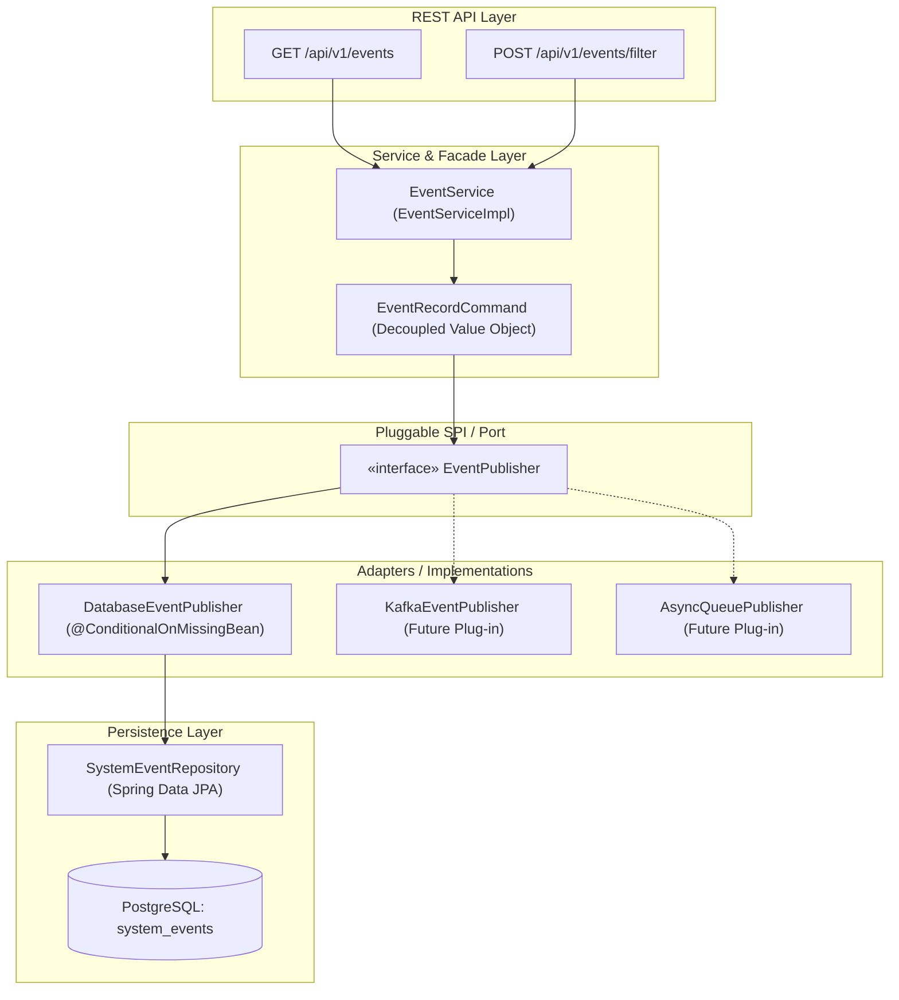

# 📡 OmniLedger: Immutable System Event & Audit Architecture

## 📌 Executive Summary
In mission-critical financial ledger platforms, tracking account mutations, transaction lifecycles, and failure conditions is not an optional logging feature—it is a core regulatory requirement (SOX, GAAP, FinTech compliance). 

This document details the **System Event Architecture** built into OmniLedger, explaining the business problem it solves, why it was implemented, and why the architectural choices represent enterprise production best practices.

---

## ❓ Why We Implemented This

1. **Non-Repudiation & Audit Trail:**
   Financial platforms must prove *who* initiated an action, *what* accounts were touched, *when* it occurred, and *why* it succeeded or failed. Standard application log files (`console.log` / `app.log`) are ephemeral, prone to log rotation loss, and difficult to query systematically via REST APIs.
2. **Post-Mortem & Incident Diagnostics:**
   When a transfer fails (e.g., negative balance attempt, currency mismatch, or database lock contention), financial operations and customer support teams require structured historical event records with correlation keys (like `idempotencyKey`) to diagnose issues without digging through raw server stdout.
3. **Time-Range Ledger Reconciliation:**
   End-of-day (EOD) and intraday settlement jobs need to reconcile events across specific time windows (e.g., $X$ to $Y$ timestamps).

---

## 🛡️ What Problems It Solved

| Challenge | How Standard Apps Fail | How OmniLedger Solved It |
| :--- | :--- | :--- |
| **Transaction Rollbacks Wiping Audit Logs** | When a transfer fails with `InsufficientBalanceException`, the enclosing `@Transactional` boundary rolls back all SQL queries—including any event logs inserted during that transaction. | **`Propagation.REQUIRES_NEW`**: Event recording runs in its own isolated transaction boundary. When the money movement rolls back, the failure audit row is permanently committed to the database. |
| **Log Immutability** | Database records can be modified by rogue services or administrative scripts. | **Database & Entity-Level Immutability**: All fields on `SystemEvent` specify `updatable = false`. The event store is strictly append-only (`INSERT` and `SELECT`). |
| **Architectural Lock-In** | Logging directly to a specific SQL table couples domain logic to a single database schema, making it impossible to migrate to message queues (Kafka, SQS) later. | **Hexagonal Output Port (`EventPublisher`)**: Domain services talk to an abstraction. Persistence mechanism can be switched via YAML or swapped in test environments with zero business logic changes. |
| **Bean Collision at Runtime** | Multiple implementations of the same interface cause Spring Boot startup crashes (`NoUniqueBeanDefinitionException`). | **Enterprise Dual-Condition Strategy**: Combining `@ConditionalOnMissingBean` with `@ConditionalOnProperty` guarantees seamless zero-config defaults while providing conflict-free overrides. |
| **Slow Audit Queries** | Running queries on millions of historical audit records causes slow table scans. | **Targeted B-Tree Indexes**: Configured composite indexing on `created_at`, `user_id`, `account_id`, and `journal_entry_id`. |

---

## 🏗️ How It Is Implemented: Best-Practice Architecture

The event system follows **Hexagonal / Clean Architecture (Ports & Adapters)**:



---

## 🔍 Detailed Component Breakdown

### 1. `SystemEvent.java` (Domain Entity)
* **Table:** `system_events`
* **Immutable Fields:**
  * `eventId` (`UUID` / PK)
  * `eventType` (`ACCOUNT_CREATED`, `TRANSFER_INITIATED`, `TRANSFER_COMPLETED`, `TRANSFER_FAILED`)
  * `userId`, `accountId`, `journalEntryId` (Contextual correlation IDs)
  * `idempotencyKey` (Links API retry attempts to the exact event)
  * `payload` (`TEXT`, stores domain snapshot metadata)
  * `status` (`SUCCESS`, `FAILED`, `PENDING`)
  * `errorMessage` (`TEXT`, captures exact root cause of business rule violation)
  * `createdAt` (`TIMESTAMP WITH TIME ZONE`, indexed)

### 2. `EventPublisher.java` (The Extension Port)
A pure Java contract that decouples event creation from event persistence:
```java
public interface EventPublisher {
    void publish(EventRecordCommand command);
}
```

### 3. `EventPublisherConfiguration.java` (Dual Conditional Bean Factory)
```java
@Configuration
public class EventPublisherConfiguration {

    @Bean
    @ConditionalOnMissingBean(EventPublisher.class)
    @ConditionalOnProperty(name = "omniledger.events.publisher.type", havingValue = "database", matchIfMissing = true)
    public EventPublisher databaseEventPublisher(SystemEventRepository systemEventRepository) {
        return new DatabaseEventPublisher(systemEventRepository);
    }
}
```
* **Why `@ConditionalOnMissingBean`?** If an external service or test provides its own `EventPublisher`, Spring backs off the default bean without failing startup.
* **Why `@ConditionalOnProperty`?** Enables zero-code operational switching via configuration (`omniledger.events.publisher.type=kafka`).

### 4. `EventServiceImpl.java` (Transactional Isolation)
```java
@Override
@Transactional(propagation = Propagation.REQUIRES_NEW)
public void recordTransferFailed(UUID sourceAccountId, UUID destAccountId, String idempotencyKey, String errorMessage) {
    eventPublisher.publish(EventRecordCommand.builder()
            .eventType(EventType.TRANSFER_FAILED)
            .accountId(sourceAccountId)
            .idempotencyKey(idempotencyKey)
            .status("FAILED")
            .errorMessage(errorMessage)
            .build());
}
```
* Uses **`Propagation.REQUIRES_NEW`** to ensure that audit event records survive even if parent financial transactions trigger an automatic rollback.

### 5. `EventController.java` (Query Endpoints)
* `GET /api/v1/events` — Chronological audit trail retrieval.
* `POST /api/v1/events/filter` — High-efficiency time-window queries between UTC timestamps (`startTime` to `endTime`).

---

## 🚀 Reusability & Extraction Blueprint
Because the event system is built with pure value objects (`EventRecordCommand`) and port interfaces (`EventPublisher`), it can be cleanly extracted into a standalone library (e.g., `fintech-audit-starter.jar`) and shared across other microservices in the organization.
